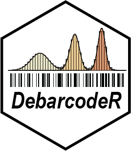

# DebarcodeR

DebarcodeR is an R package for demultiplexing **fluorescent cell barcoded (FCB)** flow
cytometry data.  In FCB, samples are labeled with combinations of amine-reactive dyes at
varying concentrations before pooling, staining, and single-tube acquisition.  After
acquisition, cells must be "debarcoded" back to their original sample of origin.
DebarcodeR automates this process to improve reproducibility and enable high-throughput
data processing.

For full details, see our paper:

> Reisman et al. (2021) *DebarcodeR: Automated demultiplexing for fluorescent cell
> barcoding.* Cytometry A.
> [doi:10.1002/cyto.a.24363](https://doi.org/10.1002/cyto.a.24363)

---

## Installation

DebarcodeR depends on **flowCore** from Bioconductor.  Install it first, then install
DebarcodeR from GitHub:

```r
# Install flowCore from Bioconductor
if (!requireNamespace("BiocManager", quietly = TRUE))
    install.packages("BiocManager")
BiocManager::install("flowCore")

# Install DebarcodeR from GitHub
remotes::install_github("cytolab/DebarcodeR")
```

Most workflows will also benefit from one or more Cytoverse packages
([CytoML](https://github.com/RGLab/CytoML),
[flowWorkspace](https://github.com/RGLab/flowWorkspace),
[ggCyto](https://github.com/RGLab/ggCyto)) for pre-processing (compensation,
transformation, gating) before debarcoding.

---

## Quick start

The four-step pipeline works on a preprocessed `flowFrame` (post compensation,
transformation, and gating):

```r
library(DebarcodeR)
library(flowCore)

data("jurkatFCB")

# 1. Create an external standard (single-well uptake control)
std_filter    <- expressionFilter(`row` == 1 & `col` == 1, filterId = "std")
jurkatFCB_std <- Subset(jurkatFCB, std_filter)

# 2. Deskew — correct for cell-size-dependent dye uptake
fcb <- fcbFlowFrame(jurkatFCB)
fcb <- deskew_fcbFlowFrame(fcb, uptake = jurkatFCB_std,
                           channel    = "Pacific Blue-A",
                           predictors = c("FSC-A", "SSC-A", "APC-H7-A"))
fcb <- deskew_fcbFlowFrame(fcb, uptake = jurkatFCB_std,
                           channel    = "Pacific Orange-A",
                           predictors = c("FSC-A", "SSC-A", "APC-H7-A"))

# 3. Cluster — estimate per-cell probabilities for each barcoding level
fcb <- cluster_fcbFlowFrame(fcb, channel = "Pacific Blue-A",   levels = 8)
fcb <- cluster_fcbFlowFrame(fcb, channel = "Pacific Orange-A", levels = 6)

# 4. (Optional) Multivariate EM refinement
fcb <- em_optimize(fcb, niter = 5)

# 5. Assign cells to barcoding levels
fcb <- assign_fcbFlowFrame(fcb, channel = "wells",
                           likelihoodcut = 12, ambiguitycut = 0.05)

# 6. Split and apply a plate map
assignments    <- getAssignments(fcb)
debarcoded_fs  <- split(jurkatFCB, assignments)

myplatemap <- data.frame(
  pacific_blue_a   = as.character(rep(1:8, times = 6)),
  pacific_orange_a = as.character(rep(1:6, each  = 8)),
  well             = paste0(rep(LETTERS[1:8], times = 6),
                            formatC(rep(1:6, each = 8), width = 2, flag = "0"))
)
debarcoded_fs <- apply_platemap(debarcoded_fs, myplatemap,
                                prefix = "Jurkat_FCB_001")

# 7. Write FCS files
write.flowSet(debarcoded_fs, outdir = "output")
```

For a detailed walkthrough with explanations of each parameter, see
`vignette("debarcoder-tutorial", package = "DebarcodeR")`.

---

## Pipeline overview

| Step | Function | Description |
|------|----------|-------------|
| 1 | `deskew_fcbFlowFrame` | Morphology correction (MARS/linear/Knijnenburg) |
| 2 | `cluster_fcbFlowFrame` | Probability estimation (GMM or Jenks breaks) |
| 3 | `em_optimize` | Multivariate EM refinement *(optional)* |
| 4 | `assign_fcbFlowFrame` | Discrete cell assignment with cutoffs |
| 5 | `getAssignments` + `split` | Split into one flowFrame per sample |
| 6 | `apply_platemap` | Map level combinations to well names |

Batch-processing variants (`deskew_fcbFlowSet`, `cluster_fcbFlowSet`,
`assign_fcbFlowSet`) accept an `fcbFlowSet` and apply the corresponding
per-frame function across all samples.

---

## Input requirements

DebarcodeR expects a **preprocessed** `flowFrame` as input — compensation,
transformation (e.g. arcsinh/logicle), and live-cell gating should be
completed upstream with flowCore/Cytoverse before calling any DebarcodeR
function.

Channel names must match the FCS parameter names exactly (e.g.
`"Pacific Blue-A"`, `"FSC-A"`).  See `?deskew_fcbFlowFrame` for details.
