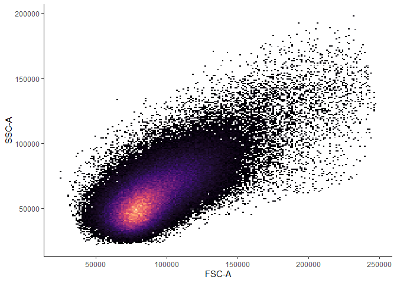
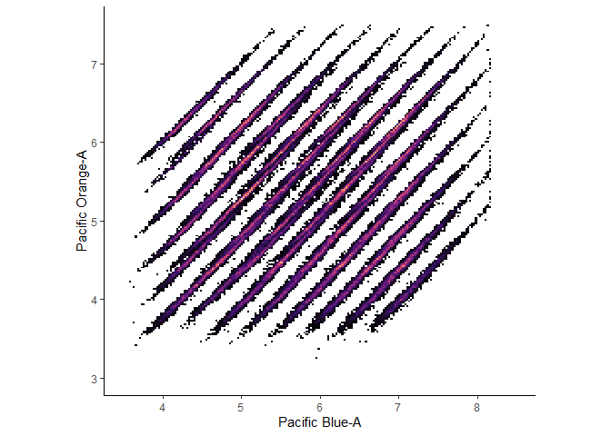
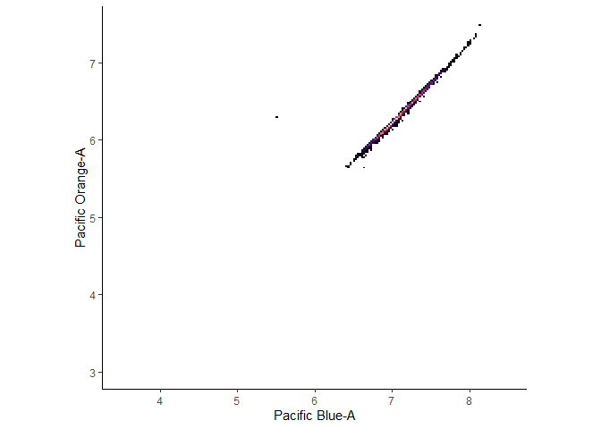

DebarcodeR is an R package for demultiplexing fluorescent cell barcoded (FCB) barcoded flow cytometery data. Fluorescent cell barcoding is a technique for implementing pooled sample multiplexing in fluorescence flow cytometery using amine reactive dyes to label each sample with unique barcodes by varying the concentration of one or more dyes. Sample can the be pooled, stained, and acquired in a single tube, which reduces instrument time and reagent consumption and improves data robustness. Following acquisition, the data must be 'debarcoded' (also known as deconvolution or demultiplexing) which traditionally has required manual biaxial gating. DebarcodeR implements an algorithm for automating this demultiplexing process which improves reproducibility and enables high throughput data processing. For more information about DebarcodeR, see our preprint (link) and for more information about FCB, see Krutzik et al. 2006.

# Installation

DebarcodeR reuses many of the classes and methods for working with FCS files implemented in the flowCore. Most workflows will also require the use of one or more of the complementary cytoverse packages such as CytoML, FlowWorkspace, and ggCyto. A Bioconductor version of DebarcodeR is in the works, but for now can be installed from github.


```r
# install flowCore first
if (!requireNamespace("BiocManager", quietly = TRUE))
    install.packages("BiocManager")
BiocManager::install("flowCore")

#Followed by DebarcodeR
remotes::install_github("bjreisman/DebarcodeR")
```

## Quick Start

Debarcoder is designed to take FCS files represented as FlowFrames as an input and provides a set of flowFrames (flowSet) as an output. It is important that the flowFrame provided as an input has been fully 'preprocessed' which includes compensation, scaling (asinh, logicile, etc...), and gating. These steps are implemented in flowCore and related packages including CytoML and flowWorkspace. This quick-start guide assumes you are starting from a preprocessed flow-frame. If you're starting from unprocessed FCS files, please see the one of the other tutorials for guidance.


```r
library(flowCore)
library(debarcoder)
library(ggcyto)
library(dplyr)
```

## Tutorial Dataset

The dataset included with DebarcodeR consists of 191,233 jurkat cells barcoded with 8 levels of Pacific Orange, 6 levels of Pacific Blue, and 1 level of Alexa 750 [on channel APC-H7] for a total of 48 'samples.' Each sample was run separately and combined in R. This corresponds to **Dataset 2** in our manuscript.


```r
data("jurkatFCB")

jurkatFCB
```

```
## flowFrame object 'truth.FCS'
## with 191233 cells and 16 observables:
##                  name             desc     range  minRange  maxRange
## $P1              Time             Time    262144         0    262143
## $P2             FSC-A            FSC-A    262144         0    262143
## $P3             FSC-H            FSC-H    262144         0    262143
## $P4             FSC-W            FSC-W    262144         0    262143
## $P5             SSC-A            SSC-A    262144         0    262143
## ...               ...              ...       ...       ...       ...
## $P12 Pacific Orange-A Pacific Orange-A    262144 -0.685128   8.15916
## $P13             PE-A             PE-A    262144 -0.247466   8.15916
## $P14         APC-H7-A         APC-H7-A    262144 -0.362039   7.46601
## $P15              row              row        16  0.000000   7.00000
## $P16              col              col        16  0.000000   9.00000
## 222 keywords are stored in the 'description' slot
```

```r
ggplot(jurkatFCB, aes(x= `FSC-A`, y = `SSC-A`)) + 
  geom_bin2d(bins = 200) + 
  theme_classic() + 
  scale_fill_viridis_c(option = "A", guide = F)
```

<!-- -->

```r
ggplot(jurkatFCB, aes(x= `Pacific Blue-A`, y = `Pacific Orange-A`)) + 
  geom_bin2d(bins = 200) + 
  theme_classic() + 
  scale_fill_viridis_c(option = "A", guide = F) + 
  scale_x_continuous(limits = c(3.5, 8.5)) + 
  scale_y_continuous(limits = c(3, 7.5)) + 
  coord_fixed()
```

```
## Warning: Removed 8 rows containing non-finite values (stat_bin2d).
```

```
## Warning: Removed 3 rows containing missing values (geom_tile).
```

<!-- -->

One of the experimental controls that allows DebarcodeR to accurately model dye uptake is the 'external standard' which consists of a single sample which has been stained with a single level of each barcoding dye. In this case, since each tube was run separately we can pull out any single 'sample' to use as our external standard, though in the 'real world' we won't normally have a 'truth' column to filter on.


```r
filter.11 <- expressionFilter(`row` == 1 & `col` == 1, filterId="rowfilter")
jurkatFCB.std <- Subset(jurkatFCB, filter.11)
jurkatFCB.std
```

```
## flowFrame object 'truth.FCS'
## with 4130 cells and 16 observables:
##                  name             desc     range  minRange  maxRange
## $P1              Time             Time    262144         0    262143
## $P2             FSC-A            FSC-A    262144         0    262143
## $P3             FSC-H            FSC-H    262144         0    262143
## $P4             FSC-W            FSC-W    262144         0    262143
## $P5             SSC-A            SSC-A    262144         0    262143
## ...               ...              ...       ...       ...       ...
## $P12 Pacific Orange-A Pacific Orange-A    262144 -0.685128   8.15916
## $P13             PE-A             PE-A    262144 -0.247466   8.15916
## $P14         APC-H7-A         APC-H7-A    262144 -0.362039   7.46601
## $P15              row              row        16  0.000000   7.00000
## $P16              col              col        16  0.000000   9.00000
## 222 keywords are stored in the 'description' slot
```

```r
ggplot(jurkatFCB.std, aes(x= `Pacific Blue-A`, y = `Pacific Orange-A`)) + 
  geom_bin2d(bins = 200) + 
  theme_classic() + 
  scale_fill_viridis_c(option = "A", guide = F) + 
  scale_x_continuous(limits = c(3.5, 8.5)) + 
  scale_y_continuous(limits = c(3, 7.5)) + 
  coord_fixed()
```

<!-- -->

## Deskewing

The first step of the debarcoder pipeline is what we call 'deskewing,' where we try to predict dye uptake based on the other channels. FSC and SSC are good channels to start with and what were used in Knijnenburg TA, Mol Sys Bio, 2011. In addition to the standard 'area' parameter, we can add 'height' and 'width' as well which provide a small amount of extra information about the cell.

The channel which has the most impact on the effectiveness of deskeweing is the 'internal standard' channel, in this case Alexa Fluor 750 (on channel APC H7-A). This is another NHS ester dye that's added to each well at a fixed concentration across all samples which provides a direct measurement of dye uptake for each cell.

Predictors as supplied as a character vector. Internally, this function uses `janitor::clean_names()` function to sanitized the input. The deskew function is called once for each barcoding channel with the output saved in the `@barcodes` slot of the object.


```r
my.predictors <- c("fsc_a", "ssc_a",
                   "fsc_h", "ssc_h",
                   "fsc_w", "ssc_w",
                   "apc_h7_a")

debarcoded.ff <- deskew_fcbFlowFrame(jurkatFCB,
                                     uptake = jurkatFCB.std,
                                     predictors = my.predictors,
                                     channel = c("pacific_blue_a"))

debarcoded.ff <- deskew_fcbFlowFrame(debarcoded.ff, #output of first run
                                     uptake = jurkatFCB.std,
                                     predictors = my.predictors,
                                     channel = c("pacific_orange_a"))
```

## Clustering

#### Univariate Clustering

The next step is to cluster the 'deskewed' data to estimate the barcoding level probabilities for each cell. The only variable needed is the number of barcoding levels expected, though there are some advanced options (non-parametric clustering, skewed distributions, etc...) that can help with imperfect data.


```r
debarcoded.ff <- cluster_fcbFlowFrame(debarcoded.ff,
                                      channel = c("pacific_orange_a"),
                                      levels = 6)
debarcoded.ff <- cluster_fcbFlowFrame(debarcoded.ff,
                                      channel = c("pacific_blue_a"),
                                      levels = 8)
```

#### Multivariate Clustering

The univariate clustering provides an estimate for each cell originating from each level, assuming the levels are independent. In reality, each sample is barcoded with both levels, and if there was some pipetting error, the two levels can move together up or down. To get better clustering, we can further refine the estimates by clustering on each sample rather than each level. Note that if a sample is nearly or completely missing, this could lead to strange results as it tries to fit to a population that doesn't exist.


```r
debarcoded.ff <- em_optimize(debarcoded.ff, niter = 5)
```

```
## Initializing...
## EM Round 1 of 5 ... loglik: -94680
## EM Round 2 of 5 ... loglik: -27331
## EM Round 3 of 5 ... loglik: -22387
## EM Round 4 of 5 ... loglik: -21780
## EM Round 5 of 5 ... loglik: -21714
## Calculating probabilities...Done!
```

## Assignments

The final step is to assign each cell to a well based on the probabilities calculated in the clustering step. The `channels` can be used to assign a single channel as before, or to assign each well based on the multivariate model by specifying the `"well"` as the channel.

The `likelihoodcut` and `ambiguitycut` options allow one to remove cells in areas of low density or cells that lie between two levels respectively. A likelihood cutoff of 12 will remove any cell which has a likelihood of originating from the well that is less than 1/12th of the most likely cell from that well. An ambiguity cutoff of 0.05 will remove any cell that has a greater than 5% chance of originating from a different well. These options can be adjusted based on your tolerance for mis-assignments with more stringent setting possibly resulting in fewer mis-assignments at the cost of assigning fewer cells.

Unassigned cells are not discarded, but rather assigned a level of 0. The `getAssignments` function pulls out the assignments as a list of factors which can be passed to `split`.


```r
debarcoded.ff <- assign_fcbFlowFrame(debarcoded.ff,
                                  channel = c("wells"),
                                  likelihoodcut = 12,
                                  ambiguitycut = 0.05)

myassignments <- getAssignments(debarcoded.ff)

str(myassignments)
```

```
## List of 2
##  $ pacific_blue_a  : Factor w/ 9 levels "0","1","2","3",..: 2 2 2 2 2 2 2 2 1 2 ...
##  $ pacific_orange_a: Factor w/ 7 levels "0","1","2","3",..: 2 2 2 2 2 2 2 2 1 2 ...
```

## Generating FCS Files

The final step is to apply the assignments to the data which converts to the flowFrame (representing a single FCS file) to a flowSet (representing a collection of FCS files). This part of the workflow is largely outsourced to flowCore though we have added a modified `split` function which can accept lists of variables in addition to a single variable. The `apply_platemap` function takes care of updating the pData and filenames such that all files have a common prefix followed by their well.


```r
debarcoded.fs <- split(jurkatFCB, getAssignments(debarcoded.ff))
```

```
##     name split
## 0.0  0.0     1
## 1.1  1.1     2
## 1.2  1.2     3
## 1.3  1.3     4
## 1.4  1.4     5
## 1.5  1.5     6
## 1.6  1.6     7
## 2.1  2.1     8
## 2.2  2.2     9
## 2.3  2.3    10
## 2.4  2.4    11
## 2.5  2.5    12
## 2.6  2.6    13
## 3.1  3.1    14
## 3.2  3.2    15
## 3.3  3.3    16
## 3.4  3.4    17
## 3.5  3.5    18
## 3.6  3.6    19
## 4.1  4.1    20
## 4.2  4.2    21
## 4.3  4.3    22
## 4.4  4.4    23
## 4.5  4.5    24
## 4.6  4.6    25
## 5.1  5.1    26
## 5.2  5.2    27
## 5.3  5.3    28
## 5.4  5.4    29
## 5.5  5.5    30
## 5.6  5.6    31
## 6.1  6.1    32
## 6.2  6.2    33
## 6.3  6.3    34
## 6.4  6.4    35
## 6.5  6.5    36
## 6.6  6.6    37
## 7.1  7.1    38
## 7.2  7.2    39
## 7.3  7.3    40
## 7.4  7.4    41
## 7.5  7.5    42
## 7.6  7.6    43
## 8.1  8.1    44
## 8.2  8.2    45
## 8.3  8.3    46
## 8.4  8.4    47
## 8.5  8.5    48
## 8.6  8.6    49
```

```r
#make a platemap
myplatemap <- tibble(
  `Pacific Blue-A` = rep(1:8, times = 6),
  `Pacific Orange-A` = rep(1:6, each = 8)
) %>% 
  mutate(well = paste0(LETTERS[`Pacific Blue-A`], "0", `Pacific Orange-A`)) %>%
  janitor::clean_names() %>%
  mutate_all(as.character)

debarcoded.fs <- apply_platemap(debarcoded.fs,
                                myplatemap,
                                prefix = "Jurkat_FCB_001")


#pretty plot, each well is a random color
mypal <- c(sample(scales::hue_pal()(48)), "grey50")

ggplot(debarcoded.fs, aes(x=`Pacific Blue-A`,
                          y = `Pacific Orange-A`,
                          col = well)) +
  geom_point(shape = ".", alpha = 0.1) + 
  scale_color_manual(values = mypal, guide = F) + 
  theme_classic() + 
  coord_fixed()
```

<!-- -->


```r
dir.create("readme_output")
write.flowSet(debarcoded.fs, outdir = "readme_output")
```
